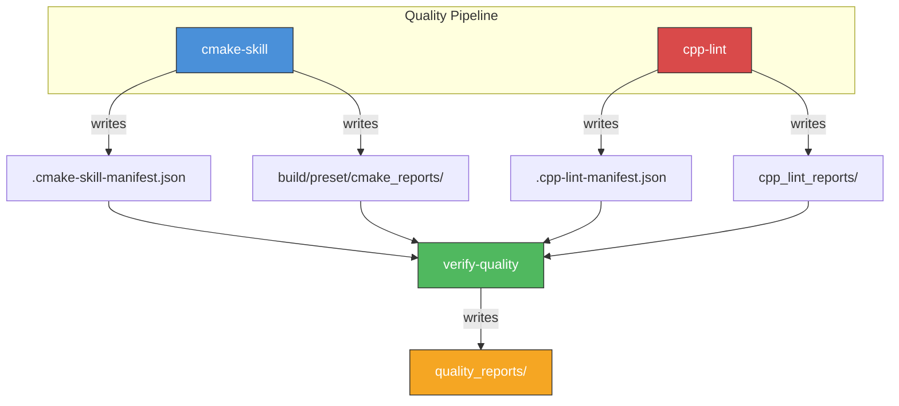

# cmake-skill 🤖 [AI Agent Skill]

**Diagnostic-First CMake Automation for Autonomous AI Agents.**

`cmake-skill` provides deep visibility into the CMake build lifecycle. It captures complex configuration failures and maintains a persistent view of project health across multiple development phases.

## 🌟 Key Features

- **Hierarchical Parsing**: State-machine engine captures multi-line error messages and full `include()` call stacks.
- **Unified Pipeline**: Coordinated execution of formatting, linting, configuration, building, and testing.
- **Persistent Status**: Tracks the state of each build phase across runs via a structured dashboard.
- **Domain Specificity**: Custom command validation for IP development workflows (e.g., CPM.cmake integration).

## 🛠 Installation

Requires `cmake`, `ninja`, and `uv`.

```bash
git clone https://github.com/hiono/cmake-skill ~/.agents/skills/cmake-skill
```

## 📖 Usage

```bash
# Run full quality-gate pipeline
./scripts/cmake-skill pipeline

# Configure with precision error capture
./scripts/cmake-skill configure

# Static analysis for CMake scripts
./scripts/cmake-skill lint
```

## 🤖 Reasoning Protocol

Refer to **[protocol.md](references/protocol.md)** to maintain project health and recover from build failures.

## 🔗 Orchestration



This skill **writes** reports to `cmake_reports/` and `.cmake-skill-manifest.json`.
It does **not** depend on other skills, but other skills (verify-quality) read its output.

---
Maintained by **hiono**. Version **v0.3.2**.